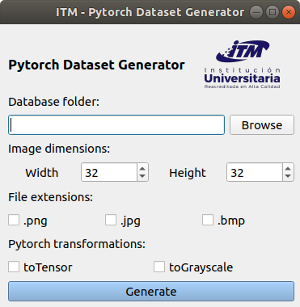

# DATASETS Y DATALOADERS EN PYTORCH

## Una breve introducción a datasets y dataloaders en pytorch

La idea detrás de los datasets en pytorch es descentralizar el código para cargar los datos de un datset del código de entrenamiento de un modelo. Pytorch dispone de dos objetos:

	torch.utils.data.DataLoader y
	torch.utils.data.Dataset 

que permiten cargar y usar datasets preexistentes y datasets propios. `Dataset` almacena los datos y etiquetas en memoria, mientras que `Dataloader` crea un iterable alrededor de `Dataset` para acceder a las muestras.

Entre los tipos de datasets preexistentes en pytorch se encuentran [imágenes](https://pytorch.org/vision/stable/datasets.html), [texto](https://pytorch.org/text/stable/datasets.html) y [audio](https://pytorch.org/audio/stable/datasets.html).

### Paquetes necesarios

1. Pytorch
2. Torchvision
3. Pandas
4. Numpy
5. Matplotlib
6. PIL

## Vamos a la práctica

### Cargar un dataset preexistente

Los datasets preexistentes de pytorch se encuentran en la librería `torchvision`. Aunque para cargar cada dataset preexistente en torchvision se tienen diferentes parámetros, la función de cada uno de ellos en general viene siendo similar. Por ejemplo, para cargar la base de datos `Fashion-MNIST` de acuerdo a la [documentación oficial](https://pytorch.org/tutorials/beginner/basics/data_tutorial.html), se tiene:

	import torch
	from torch.utils.data import Dataset
	from torchvision import datasets
	from torchvision.transforms import ToTensor
	import matplotlib.pyplot as plt

	training_data = datasets.FashionMNIST(
	    root="data",
	    train=True,
	    download=True,
	    transform=ToTensor()
	)

	test_data = datasets.FashionMNIST(
	    root="data",
	    train=False,
	    download=True,
	    transform=ToTensor()
	)

Dónde:

`root` es la ruta donde se encuentran los datos almacenados

`train` especifica si se va a usar la partición de entranamiento o de pruebas

`download` especifica si se quiere descargar el dataset o no y

`transform` y `target_transform` especifica las transformaciones que se quieren hacer sobre los datos y las etiquetas.

## Generador automático de Datasets de pytorch

El generador automático consta de una sencilla interfaz gráfica desde la cual el usuario puede establecer
los parámetros que requiere.

En primer lugar se debe buscar la carpeta donde se encuentran los datos, para ello se debe hacer click en el botón `Browse` para abrir el navegador de carpetas y seleccionar la indicada. 

Luego se debe indicar al programa la dimensión o resolución en pixeles a la que se desea cargar las imágenes. 

Después de especificar el tamaño debe indicarse los formatos de imagen con los que se desea trabajar. Los formatos incluidos son `jpg`, `png` y `bmp`. Puede elegirse varios al tiempo.

Por último, especificar las transformadas de `torchvision` que se desea incluir en el dataloader.  